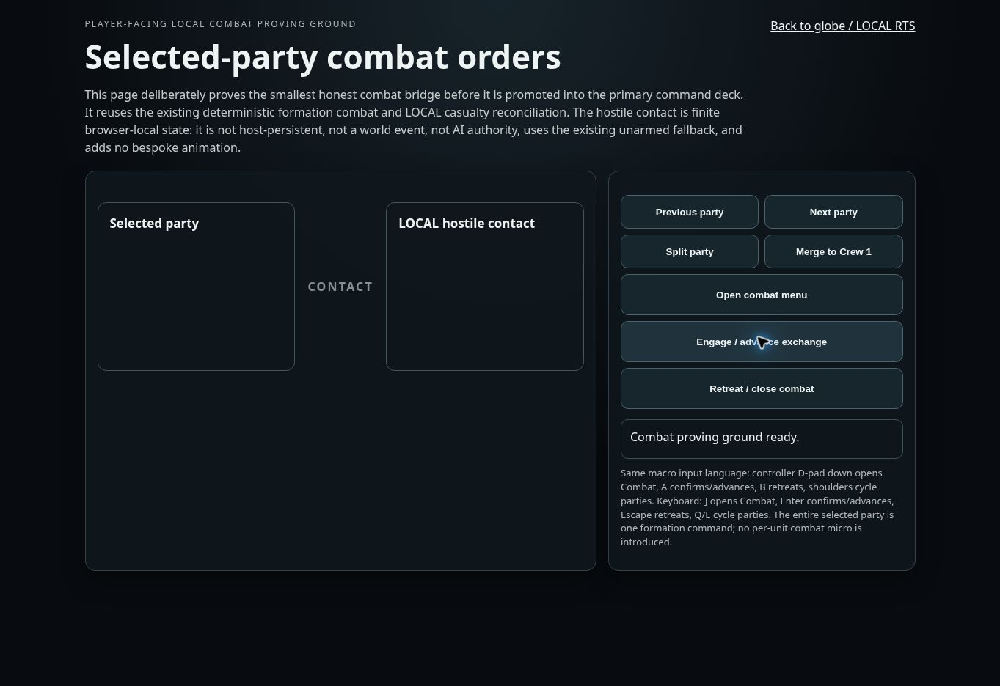

# Cloud browser playtest evidence — 2026-09-15

## Scope

Evidence-only review of the public browser entry points at commit `0557585bd3f9b972ae1218918515bab2b24ea039` (current `main` when the run began). No gameplay/runtime files were changed.

Browser: managed Chrome cloud session, 1364 × 936 viewport.  
Observed: 2026-09-15 09:40–09:46 UTC.

## Attempted routes

1. Repository run contract from README: `npm start` → `http://127.0.0.1:4174/game/`.
2. GitHub Pages candidate: `https://mike-axiom-mir.github.io/axm-global-state-rts/game/`.
3. Public repository preview through htmlpreview.
4. Commit-pinned module preview through raw.githack for:
   - `game/index.html`
   - `game/combat-proving-ground.html`

## Observations

### Main globe / LOCAL RTS shell

The HTML and CSS render, but the game does not initialize in this cloud browser:

- the left playfield remains blank;
- `#viewport` has 0 children;
- `#seatSetup` has 0 children;
- `window.__AXM_GLOBAL_STATE_RTS__` is undefined;
- the visible status remains `Waiting for input`;
- this browser reports `typeof window.WebGLRenderingContext === "undefined"`.

The htmlpreview route is not a valid module test because it rewrites each module script to `type="text/htmlpreview"`. The module-capable raw.githack route preserves `type="module"`, but initialization still does not complete in this browser. Because this run did not capture a JavaScript console stack, the evidence supports a **boot/compatibility failure**, not a unique root-cause claim.

GitHub Pages currently returns “Site not found”, so there is no stable first-party public build URL for ordinary browser-only reviewers.

### LOCAL combat proving ground

The static proving-ground layout renders clearly. However:

- selected-party content remains empty;
- hostile/contact statistics remain empty;
- status stays `Combat proving ground ready.`;
- clicking **Open combat menu** and **Engage / advance exchange** produces no state or status change.

This is not evidence that combat gameplay is broken under the documented local Node server. It is evidence that the public browser-only path did not reach an interactive runtime at this revision.

## Product feedback

### What is already working visually

- The dark industrial treatment feels coherent and specific rather than template-like.
- The proving-ground control grouping is easy to scan.
- The copy is unusually honest about browser-local state, host persistence, AI authority, and unproven quality boundaries.
- The underlying idea—globe-scale strategy collapsing into aggregate LOCAL parties/convoys—reads as distinctive.

### Highest-value next steps

1. **Publish one stable, revision-pinned browser build.** A GitHub Pages/Actions artifact or equivalent should serve the complete module graph with correct MIME/CORS behavior and expose a URL that does not require `npm start`.
2. **Fail visibly during boot.** Replace the silent black field with a compact diagnostic panel that reports module boot, WebGL/WebGPU availability, renderer creation, and asset-loading state.
3. **Gate controls on runtime readiness.** The combat buttons look active when their state module has not initialized. Disable them until ready and show an actionable boot error.
4. **Add an external-browser smoke gate.** At minimum assert:
   - `window.__AXM_GLOBAL_STATE_RTS__` exists;
   - the viewport has a renderer child;
   - at least one seat card is populated;
   - one proving-ground action mutates visible state/status;
   - a screenshot artifact is uploaded.
5. **Reduce first-screen instruction density.** The main shell's right rail is dominated by a long control/truth wall. Keep the honesty, but collapse it into **How to play** and **Current limitations**, with one primary **Start LOCAL skirmish** action.

## Current impression

The architecture and truth boundaries appear substantially further along than the player-facing entry experience. From a browser-only reviewer’s perspective, this currently reads as an ambitious, thoughtfully governed RTS research harness whose most important missing feature is a dependable way to actually enter the game.

## Truth boundary

This run did **not** validate globe movement, LOCAL simulation, construction, production, vehicles, strategic routes, combat resolution, controller parity, persistence, host authority, performance, or balance. No local server was reachable from the managed browser. The screenshots and DOM checks only establish the public-path behavior described above.
