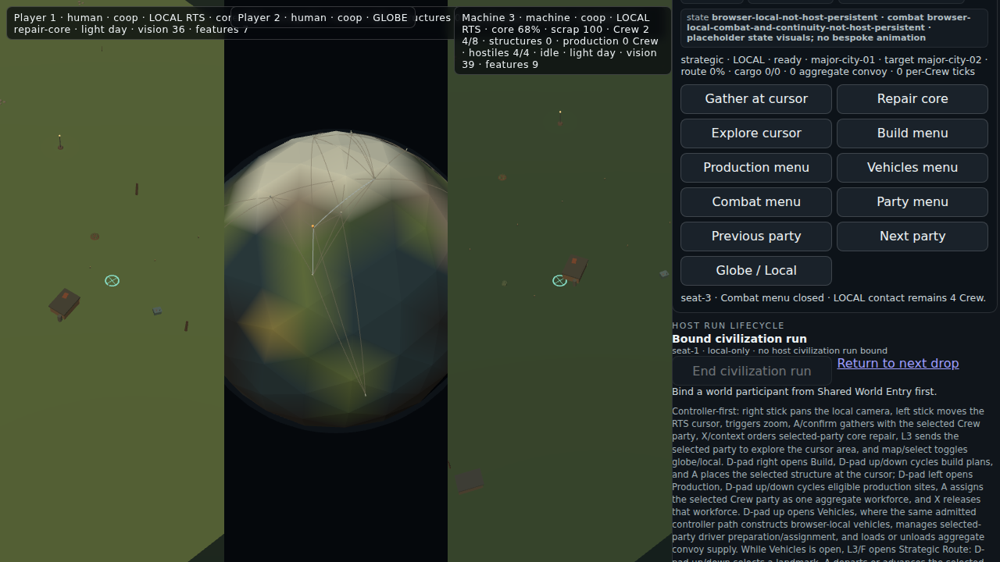
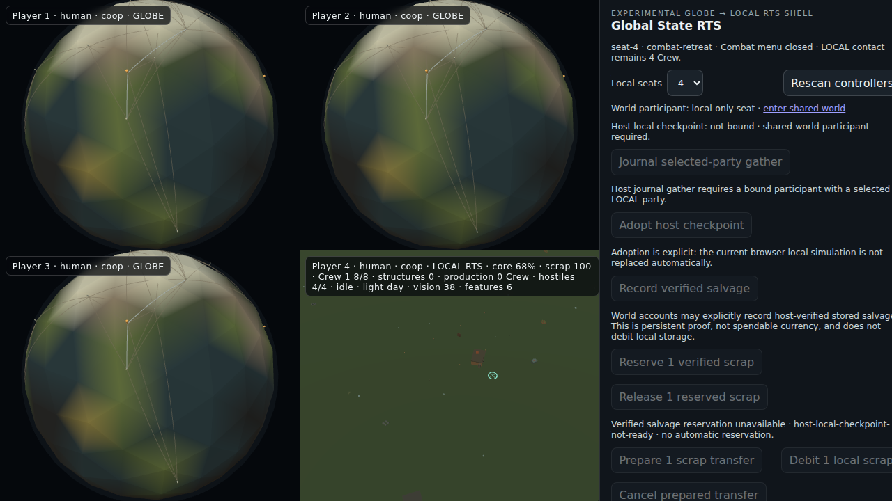
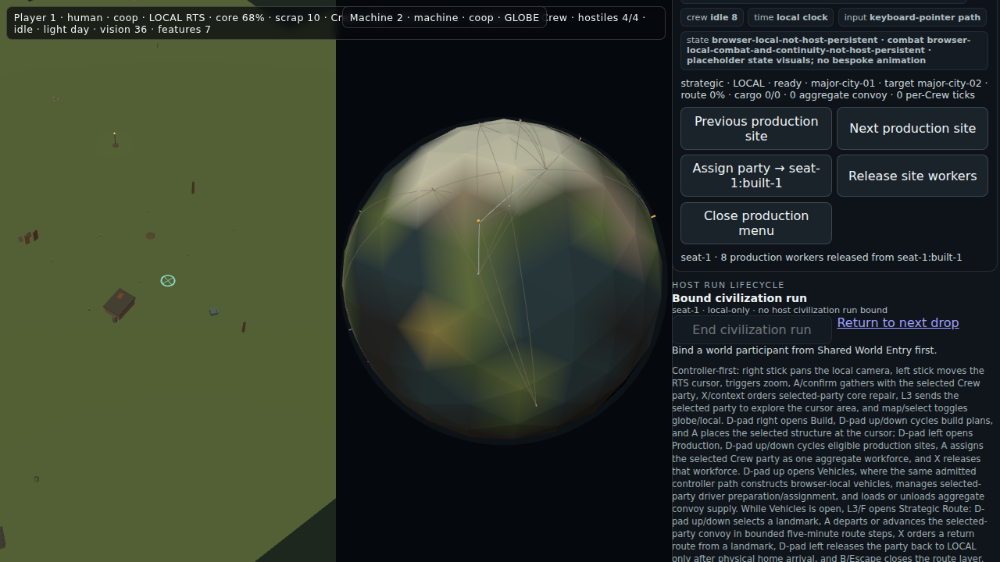
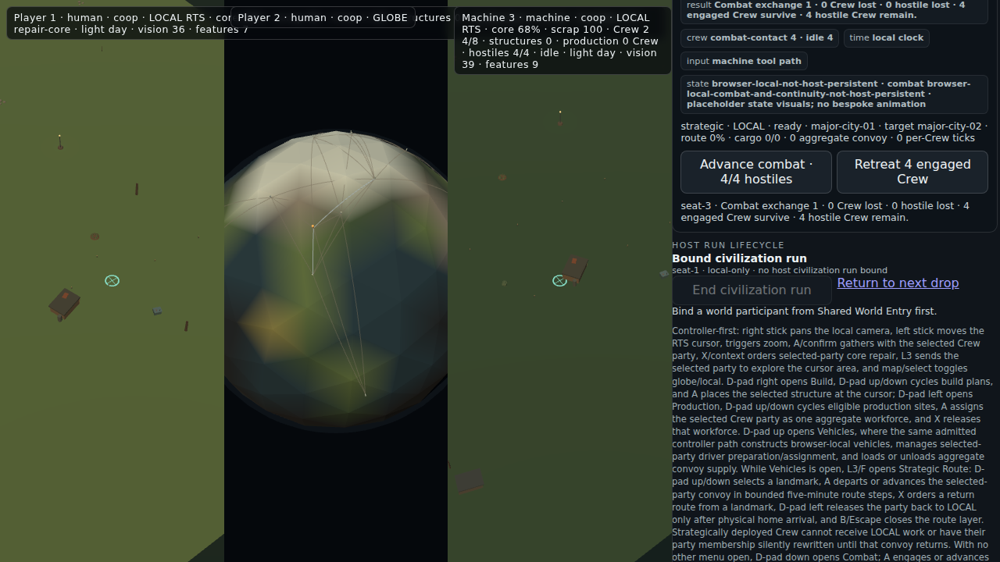
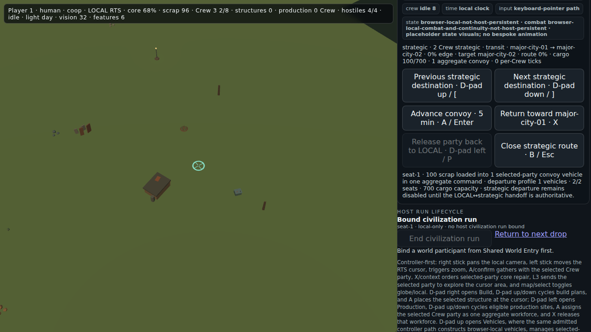

# Foundation Planet RTS visual review — corrected 2026-09-15

> **Correction:** the first version of this report over-weighted a managed-browser WebGL boot failure and did not inspect the repository's fresh real-Chromium artifacts. That conclusion was incomplete. The RTS **is built on the Foundation Planet**. This version replaces that interpretation with source and visual evidence.

## Scope and source identity

Reviewed current `main` at `0557585bd3f9b972ae1218918515bab2b24ea039`.

The planet relationship is explicit in source:

- `src/presentation/planet-renderer.mjs` imports Three.js and `sampleVector` from `planet-upstream/worlds/foundation-planet/`;
- it constructs the RTS globe from the Foundation Planet biome/elevation sampler;
- the rendered mesh is named `global-state-rts-foundation-planet`;
- each seat can occupy the same renderer in `GLOBE` or `LOCAL RTS` mode.

No gameplay/runtime files are changed by this evidence branch.

## Evidence provenance

The following images were generated by successful real-Chromium GitHub Actions runs and then manually inspected:

- controller-shell artifact `10386366152`, run `34942889478`, head `9fa0d55f1482e9f3f18b430a1c0f554f1e462799` (merged through PR #144 into current main);
- strategic-convoy artifact `10385582033`, run `34942117901`, head `e9b55ea7e66bd4509741fd8eb06f2c9146095b17` (merged through PR #140).

### Planet + LOCAL gameplay surface

Visible:

- the Foundation Planet is rendered as a faceted spherical world with biome/elevation color variation;
- Player 2 is in `GLOBE` while Player 1 and Machine 3 are simultaneously in `LOCAL RTS`;
- LOCAL views contain a settlement structure, salvage/props, cursor reticle, vision/features state and command feedback;
- the command deck exposes gather, repair, explore, build, production, vehicles, combat, party and globe/local actions.

### Four-seat planet/local split

Visible:

- four independent seats are present;
- Players 1–3 show the Foundation Planet in GLOBE mode;
- Player 4 shows a LOCAL RTS surface;
- the shell preserves per-seat labels and state while the shared command/host panel remains on the right.

### Construction and production

Visible:

- one LOCAL RTS seat and one GLOBE seat coexist;
- LOCAL terrain contains the settlement/core presentation and small world objects;
- the production deck exposes site cycling, aggregate party assignment and worker release;
- the status line records eight production workers released from a built site.

### Selected-party combat

Visible:

- the primary command deck shows a completed combat exchange;
- the state reports 0 Crew lost, 0 hostile lost, 4 engaged Crew surviving and 4 hostile Crew remaining;
- Advance and Retreat remain explicit player actions;
- the Planet and LOCAL views remain visible beside the combat state.

### Aggregate strategic convoy

Visible:

- two Crew are marked strategic and in transit from `major-city-01` toward `major-city-02`;
- one aggregate convoy carries 100/700 cargo;
- the route layer exposes destination selection, five-minute advancement, return, release and close controls;
- the local surface remains the visual background while the strategic state is expressed in the command deck.

## What feels strong already

- **The core identity is real:** global spherical world plus cheap LOCAL RTS frames is visible, not merely described.
- **Human/machine parity is legible:** a machine seat appears in the same play surface and state language as human seats.
- **The systems breadth is unusually far along:** gathering, repair, construction, production, parties, vehicles, combat and strategic convoy state all meet in one shell.
- **Truth boundaries are explicit:** browser-local state, host limits and placeholder visuals are not hidden.
- **Split-screen ambition is concrete:** the four-seat frame proves the renderer is being exercised beyond a single-player mock-up.

## What currently weakens the game feeling

1. **LOCAL terrain is too empty and low-contrast.** Units, salvage and structures are tiny against a broad olive field. The simulation may know what everything is, but the player has to hunt for it.
2. **Planet-to-LOCAL continuity is visually under-explained.** The globe is clearly the Foundation Planet, but these stills do not show which world location owns a LOCAL surface or how the camera travels between them.
3. **The command deck reads like a diagnostic console.** Important game actions compete with long state strings, host lifecycle information and a full control manual.
4. **The globe needs stronger strategic readability.** Route lines and landmarks are thin; territory, city identity, convoy direction and selected destination should read immediately.
5. **Action feedback is mostly textual.** Combat and convoy state are present, but the player-facing world needs stronger selection, movement, impact, construction-progress and arrival feedback.

## Highest-value next build direction

### 1. Make the Foundation Planet relationship unmistakable during play

Show a selected world marker, draw the active route, and make the GLOBE → LOCAL camera transition visibly land at that exact position. Preserve the same location identity in the LOCAL HUD.

### 2. Add a readability pass before adding more systems

Prioritize:

- larger and more distinct Crew/vehicle silhouettes;
- selected-party outlines and destination lines;
- visible settlement footprints, roads and resource clusters;
- terrain variation that communicates traversable space and biome;
- combat contact markers and construction progress in the world.

### 3. Separate game controls from evidence/debug information

Keep the detailed truth material, but place it behind expandable **Evidence**, **Host state** and **How to play** panels. The default deck should show the current objective, selected party, resources and 4–6 context-relevant actions.

### 4. Give the player one immediate purpose

A short first objective—find scrap, restore the core, establish one production site, then dispatch a convoy—would turn the existing systems into a readable session rather than a collection of available operations.

### 5. Keep the browser-entry repair, but as access work

The managed cloud browser used for this review did not expose WebGL, so the public preview showed a black field. That is an access/boot-diagnostics gap, **not evidence that the game is not built on the Planet**. A stable deployed build and a visible renderer-failure message would still help outside reviewers.

## Current impression

This is a real Foundation Planet RTS systems prototype, not a detached menu experiment. Its strongest achievement is that planet-scale, LOCAL, human/machine, party, production, combat and convoy concepts are already sharing one executable shell. The next leap is mainly presentation and player purpose: make the world state readable without decoding the evidence console.

## Truth boundary

The CI screenshots prove that the named rendered states existed in successful real-Chromium workflow runs. A still image does not prove motion quality, input timing, persistence, balance, controller hardware feel or the full route from launch to outcome. The managed cloud browser in this review could not independently run the WebGL surface, so no fresh hands-on control claim is made.
